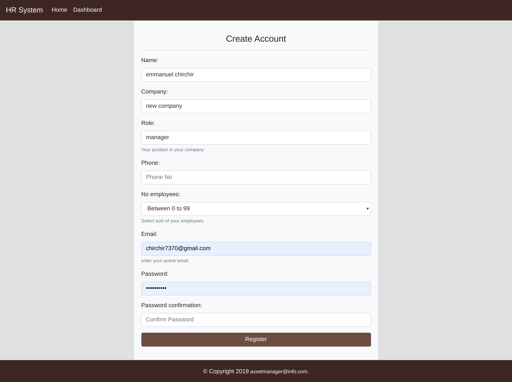
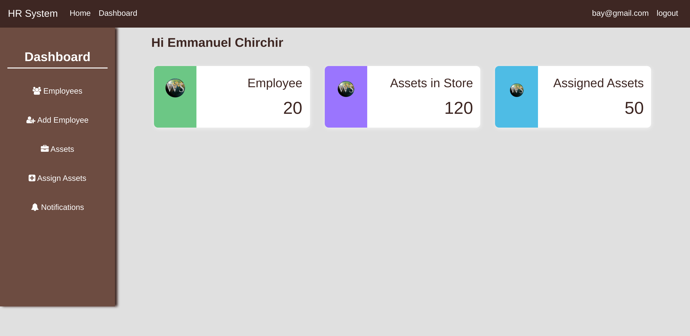
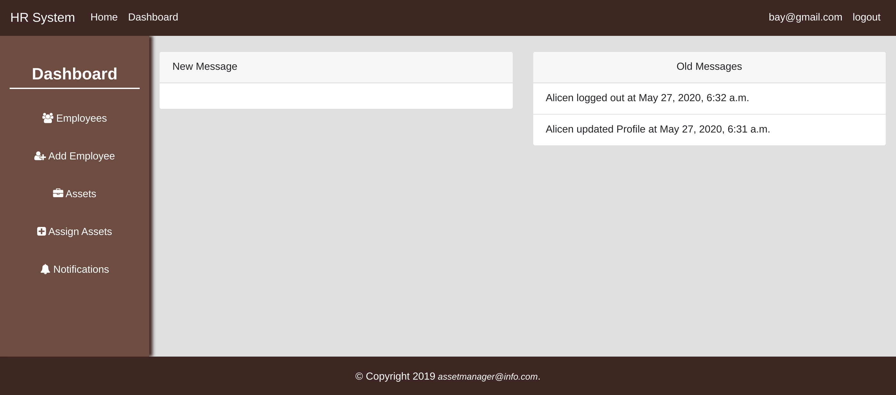
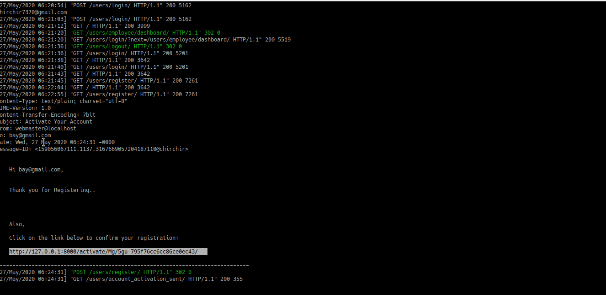

#  Django Project: AssetManager
this is an asset management system that help in managing assets in an organization. in this regard, it has two type of users; employee and employer. Employers register directly with the system while employees are added to the system by the employer. the system keep track of employees activities by sending real-time logs to the employee. 

## Achievements
1. create custom user model in django
2. allow employer to register via email confirmation --send to the terminal for now---
3. allow employer to add employee by giving out name and email
4. allow employer to assign an asset to employee 
5. show employee activity logs such as update profile, login, logout
6. allow employees to via email send to them
7. allow employees to update profile 
8. allow employee to view assets assign to them
9. Manage authentiation in Django
10. form validation

## getting started
* ensure you have python3 installed
* ensure you have pip3 installed `sudo apt-get install python3-pip`
* ensure you have virtualenv installed `sudo apt-get install python3-pip`
* create virtual environment `virtualenv -p python3 myenv`
* activate virtual environment `source venv/bin/activate`
* clone repo `git clone https://github.com/chirchir12/assetManager.git`
* move to assetManager directory `cd assetManager`
* install dependencies `pip3 install -r requirements.txt`
* make migrations to avoid foreign key problems `python manage.py makemigrations users`
* migrate migrations `python manage.py migrate`
* start server `python manage.py runserver`
* go to the link `http://127.0.0.1:8000/`

## screenshots

### Employer register

### Employer dashboard 

### User logs

### email activation in terminal

## Author

##### follow me on

- Github: [@githubhandle](https://github.com/chirchir12)
- Twitter: [@twitterhandle](https://twitter.com/shadochir)
- Linkedin: [linkedin](https://www.linkedin.com/in/emmanuel-chirchir/)
- Email: [email](chirchir7370@gmail.com)

## Technologies used
* HTML5
* CSS3
* Bootstrap
* Python
* Django
* Pusher
* Mysql
* JavaScript

## Contributions, issues and feature requests are welcome!

Feel free to check the [issues page](issues/).

## Show your support

Give a ⭐️ if you like this project!

